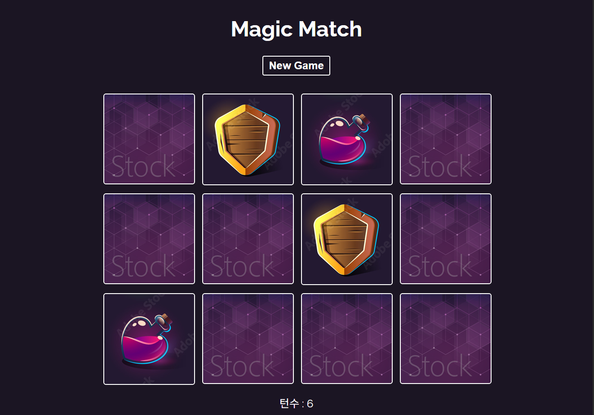

# Magic Match

React로 만든 카드 뒤집기 메모리 게임입니다. 두 장씩 카드를 뒤집어 같은 아이콘을 맞추는 게임입니다.

## Features

- 같은 카드 두 장을 맞추면 고정되고, 다른 카드면 자동으로 다시 뒤집힙니다.
- 현재 시도 횟수(턴 수)를 화면 하단에서 확인할 수 있습니다.
- `New Game` 버튼으로 카드 섞기 및 게임 초기화가 가능합니다.

## Tech Stack

- React + Hooks (`useState`, `useEffect`)

## Getting Started

- 브라우저에서 [게임 이동하기](https://magicmemory-lemon.netlify.app/) 접속 후 게임을 플레이합니다.

## Folder Structure (예시)

- `src/components` : 카드 컴포넌트, 게임 보드 컴포넌트
- `src/App.jsx` : 게임 상태 관리 및 전체 레이아웃
   
   
   

## 구현 화면

